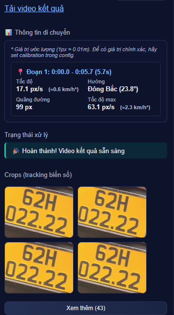
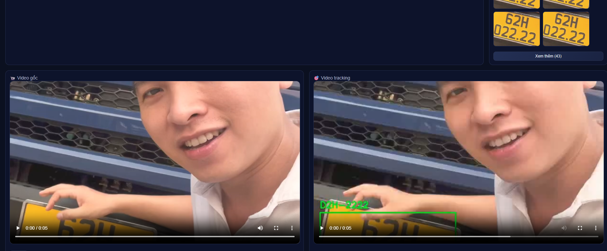

HƯỚNG DẪN SỬ DỤNG (HDSD) - SMART TRAFFIC
=========================================

Tài liệu này hướng dẫn chi tiết cách cài đặt và chạy phần mềm nhận diện biển số xe, dành cho người mới bắt đầu và không rành về kỹ thuật.

PHẦN 1: CHUẨN BỊ MÔI TRƯỜNG
---------------------------

1. Cài đặt Python (Nếu chưa có):
   - Truy cập trang web: https://www.python.org/downloads/
   - Tải xuống phiên bản Python mới nhất (khuyên dùng 3.10 hoặc 3.11).
   - Chạy file cài đặt vừa tải về.
   - QUAN TRỌNG: Ở màn hình cài đặt đầu tiên, hãy TÍCH VÀO Ô "Add Python to PATH" (Thêm Python vào biến môi trường). Nếu không tích ô này, bạn sẽ không chạy được lệnh python.
   - Nhấn "Install Now" và đợi cài đặt xong.

2. Tải mã nguồn (Code):
   - Nếu bạn nhận được file nén (.zip, .rar), hãy giải nén nó ra một thư mục. Ví dụ: `C:\Smart-Traffic`.
   - Ghi nhớ đường dẫn tới thư mục này.

PHẦN 2: CÀI ĐẶT THƯ VIỆN
------------------------

1. Mở cửa sổ dòng lệnh (Terminal/CMD) tại thư mục dự án:
   - Mở thư mục chứa code bạn vừa giải nén (bạn sẽ thấy các file như `requirement.txt`, `README.md`, thư mục `src`, v.v...).
   - Nhấn chuột vào thanh địa chỉ (thanh hiển thị đường dẫn thư mục ở trên cùng cửa sổ).
   - Xóa hết chữ trong đó, gõ chữ `cmd` rồi nhấn Enter.
   - Một màn hình đen (Command Prompt) sẽ hiện ra.

2. Cài đặt các thư viện cần thiết:
   - Tại màn hình đen `cmd`, copy dòng lệnh sau và dán vào (nhấn chuột phải để dán), sau đó nhấn Enter:
     
     pip install -r requirement.txt

   - Đợi một lúc để máy tải và cài đặt các thư viện.
   - Sau khi chạy xong lệnh trên, tiếp tục chạy thêm lệnh sau để cài đặt các thư viện chạy web (nếu chưa có):

     pip install fastapi uvicorn python-multipart

   - Đợi cài đặt hoàn tất (không còn dòng chữ đỏ báo lỗi là thành công).

PHẦN 3: CHẠY CHƯƠNG TRÌNH
-------------------------

1. Khởi động Server:
   - Vẫn tại màn hình `cmd` đó, copy và chạy dòng lệnh sau:

     python -m uvicorn src.app:app --host localhost --port 8000 --reload
HƯỚNG DẪN SỬ DỤNG (HDSD) - SMART TRAFFIC
=========================================

Tài liệu này hướng dẫn chi tiết cách cài đặt và chạy phần mềm nhận diện biển số xe, dành cho người mới bắt đầu và không rành về kỹ thuật.

PHẦN 1: CHUẨN BỊ MÔI TRƯỜNG
---------------------------

1. Cài đặt Python (Nếu chưa có):
   - Truy cập trang web: https://www.python.org/downloads/
   - Tải xuống phiên bản Python mới nhất (khuyên dùng 3.10 hoặc 3.11).
   - Chạy file cài đặt vừa tải về.
   - QUAN TRỌNG: Ở màn hình cài đặt đầu tiên, hãy TÍCH VÀO Ô "Add Python to PATH" (Thêm Python vào biến môi trường). Nếu không tích ô này, bạn sẽ không chạy được lệnh python.
   - Nhấn "Install Now" và đợi cài đặt xong.

2. Tải mã nguồn (Code):
   - Nếu bạn nhận được file nén (.zip, .rar), hãy giải nén nó ra một thư mục. Ví dụ: `C:\Smart-Traffic`.
   - Ghi nhớ đường dẫn tới thư mục này.

PHẦN 2: CÀI ĐẶT THƯ VIỆN
------------------------

1. Mở cửa sổ dòng lệnh (Terminal/CMD) tại thư mục dự án:
   - Mở thư mục chứa code bạn vừa giải nén (bạn sẽ thấy các file như `requirement.txt`, `README.md`, thư mục `src`, v.v...).
   - Nhấn chuột vào thanh địa chỉ (thanh hiển thị đường dẫn thư mục ở trên cùng cửa sổ).
   - Xóa hết chữ trong đó, gõ chữ `cmd` rồi nhấn Enter.
   - Một màn hình đen (Command Prompt) sẽ hiện ra.

2. Cài đặt các thư viện cần thiết:
   - Tại màn hình đen `cmd`, copy dòng lệnh sau và dán vào (nhấn chuột phải để dán), sau đó nhấn Enter:
     
     pip install -r requirement.txt

   - Đợi một lúc để máy tải và cài đặt các thư viện.
   - Sau khi chạy xong lệnh trên, tiếp tục chạy thêm lệnh sau để cài đặt các thư viện chạy web (nếu chưa có):

     pip install fastapi uvicorn python-multipart

   - Đợi cài đặt hoàn tất (không còn dòng chữ đỏ báo lỗi là thành công).

PHẦN 3: CHẠY CHƯƠNG TRÌNH
-------------------------

1. Khởi động Server:
   - Vẫn tại màn hình `cmd` đó, copy và chạy dòng lệnh sau:

     python -m uvicorn src.app:app --host localhost --port 8000 --reload

   - Nếu thấy hiện ra các dòng chữ như "Application startup complete", "Uvicorn running on http://localhost:8000" là thành công.
   - ĐỪNG TẮT màn hình đen này. Nếu tắt, chương trình sẽ dừng hoạt động.

2. Mở giao diện sử dụng:
   - Mở trình duyệt web (Chrome, Cốc Cốc, Edge...).
   - Nhập địa chỉ sau vào t
![Giao diện chính của phần mềm]!

(image-3.png)

(image-4.png)
*(Giao diện chính với khung video và các điều khiển)*

### 2. Cách chạy nhận diện:
- **Ô "Biển số cần tìm"**: Nhập biển số xe bạn muốn tìm (ví dụ: 29A-12345).
- **Ô "Thư mục Video"**: Mặc định là `data/videos`. Bạn có thể copy video của bạn vào thư mục `data/videos` trong thư mục code, hoặc nhập đường dẫn tới thư mục chứa video khác trên máy bạn.
- **Ô "Thư mục Output"**: Nơi lưu kết quả, mặc định là `data/outputs`.
- **Nút "Chạy thư mục"**: Nhấn để bắt đầu quét tất cả video trong thư mục đã chọn.
- **Nút "Upload + Chạy"**: Nếu bạn muốn chọn file video trực tiếp từ máy tính để chạy ngay.

### 3. Xem kết quả:
- Khi chạy, hệ thống sẽ hiển thị log (nhật ký) bên phải.
- Các hình ảnh biển số cắt được (crops) sẽ hiện ra ở cột bên phải.

![Bảng kết quả chi tiết]
*(Bảng thông tin di chuyển và các ảnh biển số cắt được)*

- Video kết quả (có vẽ khung nhận diện) sẽ hiện ở phía dưới.

![Video tracking kết quả]
*(So sánh video gốc và video đã nhận diện)*

---

## LƯU Ý CHUNG
- File `ffmpeg.exe` đã có sẵn trong thư mục code để xử lý video, không cần cài thêm.
- Nếu gặp lỗi "ModuleNotFoundError", hãy kiểm tra lại xem đã chạy đủ 2 lệnh `pip install` ở Phần 2 chưa.
- Để dừng chương trình, quay lại màn hình đen `cmd` và nhấn tổ hợp phím `Ctrl + C`.
